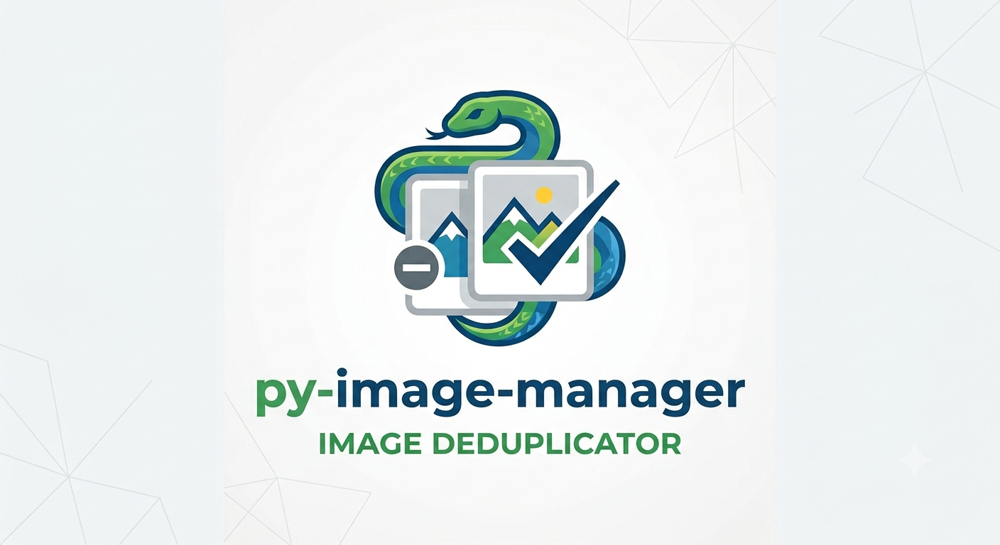

 

# py-image-manager
> image deduplicator

Small project to keep your backup images free from duplicates, keeping intact your save structure.  

If, like me, you're tired of checking your pictures one by one and deleting duplicates  
**waste your time no further**,  
this project will help you deleting duplicates and creating symlinks to one single file, reducing wasted space in your backup drive.  

---

## Getting started
If you don't have python installed, install it first:  
- **Windows / macOS**: Download the installer from [python.org/downloads](https://www.python.org/downloads/)
    - Windows: check **"Add python.exe to PATH"** during setup  

- **Linux**:
    - Debian/Ubuntu:
        ```shell
        sudo apt update && sudo apt install python3 python3-venv
        ```  
    - Fedora:
        ```shell
        sudo dnf install python3
        ```
    - Arch:
        ```shell
        sudo pacman -S python
        ```
    - Homebrew:
        ```shell
        brew install python
        ```

Verify your python installation, the project needs python **3.13 or newer**:  
```shell
python --version
```

The output should show something like:
> Python 3.13  

---

## Installation

If you have git installed start by cloning the project  
naviagate to the folder you want to use in a shell then:
```shell
git clone https://github.com/FG-GIS/py-image-manager.git
```

If you **don't** have git, click on the green code button above,  
press download zip, then extract the content to your designated folder.

Create a virtual environment to contain the requested dependencies:  

- python
    ```shell
    python -m venv venv
    ```

    activate the virtual environment:

    - linux:
        ```shell
        source venv/bin/activate
        ```
    - windows:
        ```cmd
        venv\Scripts\activate
        ```

        ```powershell
        venv\Scripts\Activate.ps1
        ```

- uv
    ```shell
    uv sync
    ```

---

## Usage step
